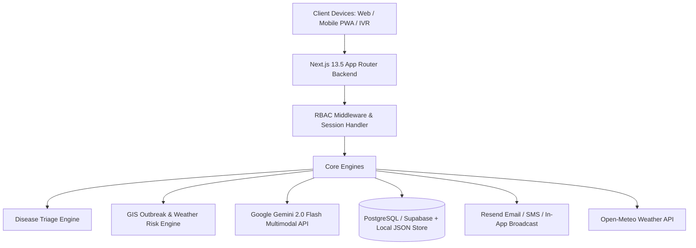
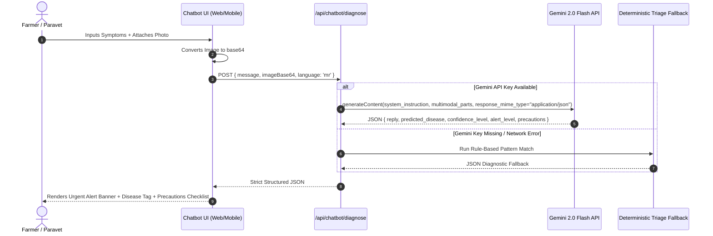
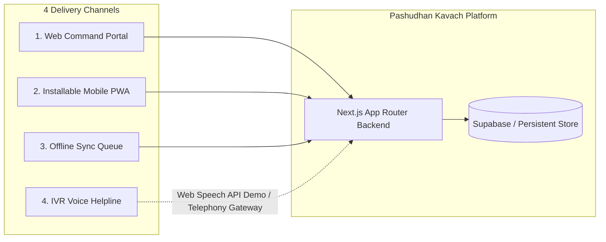
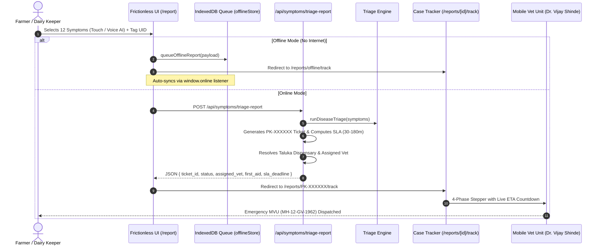

# Pashudhan Kavach (पशुधन कवच) — Full Technical Architecture & System Documentation

> **SIH 2026 Grand Finale — Technical Dossier for Jury & Evaluators**  
> *Maharashtra State Livestock Health, Epidemic Surveillance & Digital Animal Passport Platform*

---

## 1. Executive Summary

**Pashudhan Kavach** is an enterprise-grade, full-stack digital veterinary infrastructure designed for the Department of Animal Husbandry, Government of Maharashtra. The platform digitizes the entire livestock lifecycle across Maharashtra's 36 districts:
- **Early Disease Detection**: AI-assisted multimodal disease screening (symptoms + visual image recognition).
- **Epidemic Surveillance**: Real-time GIS risk heatmap correlated with Open-Meteo meteorological vectors.
- **Identity & Records**: 12-digit Bharat Pashudhan–compliant Tag UID with tamper-evident QR Digital Health Passports.
- **Diagnostics & Triage**: Automated lab sample tracking pipeline with forward-only status machines.
- **Rural Resilience**: Offline store-and-forward synchronization and browser-based IVR voice interface for non-smartphone farmers.

---

## 2. Complete Technology Stack



### Frontend Architecture
- **Framework**: Next.js 13.5 (React 18, App Router, TypeScript 5.2).
- **Styling & UI**: Tailwind CSS 3.3, Lucide React icons, Radix UI primitives (`@radix-ui/*`), Shadcn-style components.
- **Charts & Mapping**: Recharts 2.12 (analytical distribution bar/pie charts), Leaflet 1.9 (GIS spatial rendering).
- **Internationalization (i18n)**: Native client-side reactive trilingual engine supporting **Marathi (`mr`)**, **Hindi (`hi`)**, and **English (`en`)**.
- **Voice / Telephony Demo**: Web Speech API (`SpeechSynthesisUtterance`) with dialect-matched synthesis (`mr-IN`, `hi-IN`, `en-IN`).

### Backend Architecture & API Layer
- **Runtime**: Next.js Node.js Serverless Route Handlers (`app/api/**/route.ts`).
- **Data Validation**: Zod 3.23 schema validation with strict GPS bounding boxes (India coordinates `lat: 6–38`, `lng: 68–98`) and 12-digit numeric Tag UID regex.
- **Rate Limiting**: Sliding-window in-memory IP/User-level rate limiters on authentication and reporting routes.
- **Logging**: Structured, sanitized request duration & audit logging middleware.

### AI / ML & External Integrations
- **Multimodal LLM**: Google Gemini 2.0 Flash (`gemini-2.0-flash`) with structured JSON schema enforcement (`response_mime_type: "application/json"`).
- **Rule-Based Triage Engine**: Deterministic fallback expert system recognizing 7 critical Maharashtra livestock diseases (FMD, LSD, PPR, Brucellosis, Anthrax, Black Quarter, HS).
- **Weather Telemetry**: Open-Meteo REST API (ambient temperature, humidity, rainfall) for vector-borne risk scoring.
- **QR Engine**: Server-side & client-side QR generation via `qrcode` package.
- **Notification Services**: Resend API integration for email alerts + in-app notification dispatch.

### Database & Storage
- **Primary Cloud DB**: Supabase (PostgreSQL 15) with Row-Level Security (RLS) policies.
- **Local Fallback DB**: `lib/persistent-store.ts` file-based JSON persistence engine (`data/db.json`) ensuring 100% functionality in offline or local demo mode without cloud dependency.

---

## 3. Core Architectural Deep-Dives

### A. 4-Tier Role-Based Access Control (RBAC) & IDOR Defense

The platform enforces strict role separation across 4 user personas + 1 public layer:

| Role | Permissions & Scope | Restricted Boundaries |
|---|---|---|
| **Farmer (पशुपालक)** | View owned animals, download Health Passports, report symptoms, receive advisories, use AI Chatbot & IVR. | Cannot access raw lab cases or state analytics summaries (HTTP 403). Cannot access other farmers' animals (IDOR blocked). |
| **Veterinarian (पशुवैद्यक)** | Review district triage cases, issue treatments & vaccinations, publish official district advisories, view district analytics. | Cannot modify administrative master settings or override lab diagnostic test results. |
| **Lab Technician (लॅब)** | Update lab sample status (`collected` → `in_transit` → `received` → `testing` → `completed`), upload diagnostic findings. | Cannot publish farmer advisories or alter livestock ownership records. |
| **State Admin (प्रशासक)** | Full state-level visibility: 36-district analytics, outbreak heatmaps, user audits, exportable Excel/CSV reports. | All actions logged with audit trails. |
| **Public / Citizen** | Instant animal passport verification via `/api/public/verify/[tag_uid]` and public community advisory board. | Owner personal data & phone numbers scrubbed from responses. |

**Code Implementation Reference**:
- Enforced via [`lib/auth.ts:requireRole()`](file:///c:/sih2026/project/lib/auth.ts#L212-L234) and [`lib/role-features.ts`](file:///c:/sih2026/project/lib/role-features.ts).

---

### B. AI Multimodal Disease Screening Engine (`Pashudhan Sahayak`)

- **Route**: [`app/api/chatbot/diagnose/route.ts`](file:///c:/sih2026/project/app/api/chatbot/diagnose/route.ts)
- **UI**: [`app/chatbot/page.tsx`](file:///c:/sih2026/project/app/chatbot/page.tsx)



#### Diagnostic Rules Covered
1. **Foot & Mouth Disease (FMD / लाळ्या खुरकूत)**: Mouth vesicles, foot lesions, salivation, lameness.
2. **Lumpy Skin Disease (LSD / लंपी)**: Cutaneous nodular lumps (2–5 cm), edema, fever, reduced milk.
3. **Peste des Petits Ruminants (PPR)**: Goat/sheep necrotic stomatitis, foul diarrhea, discharge.
4. **Brucellosis**: Late abortions, retained placenta (zoonotic safety warnings issued).
5. **Anthrax (अँथ्रॅक्स - CRITICAL)**: Sudden death, unclotted dark blood from orifices → Immediate quarantine alert, post-mortem prohibition, 1962 SOS call.
6. **Black Quarter (BQ / फऱ्या)**: Crepitating hot swellings on shoulder/thigh, severe toxaemia.
7. **Haemorrhagic Septicaemia (HS / घटसर्प)**: Throat edema, snoring respiration, high mortality.

---

### C. GIS Outbreak Risk Engine & 5-Factor Weighted Mathematical Formulation

- **Route**: [`app/api/geo/heatmap/route.ts`](file:///c:/sih2026/project/app/api/geo/heatmap/route.ts)
- **Engine**: [`lib/services/riskEngine.ts`](file:///c:/sih2026/project/lib/services/riskEngine.ts)
- **UI / Heatmap**: [`app/heatmap/page.tsx`](file:///c:/sih2026/project/app/heatmap/page.tsx)

The platform implements an epidemiological risk model that replaces static numbers with a transparent, multi-factor linear regression and spatial spillover formula evaluated across all 36 Maharashtra districts:

$$\text{RiskScore} = 0.30 \times \text{CaseRate} + 0.20 \times \text{TrendSlope} + 0.15 \times \text{VaccGap} + 0.20 \times \text{WeatherVector} + 0.15 \times \text{NeighborSpillover}$$

$$\text{Displayed Score} = \text{round}(\text{RiskScore} \times 100) \quad [0 \text{ to } 100]$$

#### 1. Mathematical Breakdown of Subscores

| Factor | Weight | Formulation & Normalization | Description |
|---|:---:|---|---|
| **CaseRate** | **30%** | $\frac{\text{active\_flagged\_cases}_{14\text{d}}}{\text{registered\_animals}} \xrightarrow{\text{min-max}} [0, 1]$ | Proportion of livestock herd actively affected by outbreak flags in the past 14 days. |
| **TrendSlope** | **20%** | $m = \frac{N\sum(t \cdot y) - \sum t \sum y}{N\sum t^2 - (\sum t)^2} \xrightarrow{\text{min-max}} [0, 1]$ | 14-day simple linear regression slope of daily case counts ($N=14$). Identifies accelerating outbreaks vs. plateauing conditions. |
| **VaccGap** | **15%** | $1 - \frac{\text{vaccinated\_animals}}{\text{registered\_animals}} \in [0, 1]$ | Direct herd vulnerability gap. High vaccination coverage directly suppresses the composite score. |
| **WeatherVector** | **20%** | $0.45 \cdot \text{Humidity} + 0.35 \cdot \text{Rain} + 0.20 \cdot \text{Heat} \in [0, 1]$ | Open-Meteo telemetry measuring ambient conditions favoring vector propagation (LSD mosquitoes/ticks, FMD moisture, Anthrax spore resilience). |
| **NeighborSpillover** | **15%** | $\sum_{B \ne A} \frac{\text{cases}_B}{\max(10,\, d(A,B))} \xrightarrow{\text{min-max}} [0, 1]$ | Spatial transmission pressure from neighboring districts within the canonical `ALERT_RADIUS_KM` ($150\text{ km}$), weighted by Haversine distance. |

$$\sum_{i=1}^5 \text{Weight}_i = 0.30 + 0.20 + 0.15 + 0.20 + 0.15 = 1.00$$

#### 2. Dynamic Relative Percentile Bucketing
Rather than using arbitrary static score cutoffs, risk tiers are computed dynamically fresh on each evaluation across the active district dataset:
- **Low Tier**: $< 25\text{th}$ Percentile
- **Medium Tier**: $25\text{th} \le \text{Percentile} < 50\text{th}$
- **High Tier**: $50\text{th} \le \text{Percentile} < 75\text{th}$
- **Critical Tier**: $\ge 75\text{th}$ Percentile (Top Quartile)

#### 3. Administrative Override Integration
If a district veterinary authority or state administrator issues an official intervention or risk override (via `district_admin_actions` or `risk_override_level`):
- The UI prominently flags: `"Admin override — computed score: X"`.
- Both the override tier and the raw percentile bucket are preserved for transparent auditing.

#### 4. UI Tooltip & Panel Transparency
- **Leaflet Marker Hover**: Displays an interactive tooltip itemizing all 5 subscores and their weights.
- **Leaflet Marker Click / Panel View**: Expands into an interactive breakdown card with visual progress bars for each factor.

---

### D. Digital Animal Health Passport & Public Verification

- **Endpoint**: [`/api/public/verify/[tag_uid]`](file:///c:/sih2026/project/app/api/public/verify/[tag_uid]/route.ts)
- **Card Endpoint**: [`/api/animals/[id]/health-card`](file:///c:/sih2026/project/app/api/animals/[id]/health-card/route.ts)

1. **Tag UID**: 12-digit numeric identifier compliant with the National Digital Livestock Mission (NDLM / Bharat Pashudhan).
2. **QR Code Verification**: Scannable QR code embedded on the animal profile linking to a public cryptographic verification route.
3. **Data Scrubbing**: Allows cattle buyers or checkposts to verify breed, age, vaccination history, and active health status without leaking private farmer contact numbers.

---

### E. Store-and-Forward Offline Synchronization

- **Push Endpoint**: [`/api/sync/push`](file:///c:/sih2026/project/app/api/sync/push/route.ts)
- **Pull Endpoint**: [`/api/sync/pull`](file:///c:/sih2026/project/app/api/sync/pull/route.ts)

In remote rural villages with zero 4G connectivity:
1. Client devices store field vaccination records and symptom reports in local IndexedDB / local storage.
2. When network connectivity resumes, the client pushes a batch array to `/api/sync/push`.
3. The server processes entries via a **Last-Write-Wins (LWW)** strategy, logs entries in `sync_queue_items`, and explicitly flags conflicting updates for veterinary review rather than silently dropping data.

---

### F. Omni-Channel Architecture (Web, Mobile PWA, Offline, IVR Voice)

- **UI**: [`app/channels/page.tsx`](file:///c:/sih2026/project/app/channels/page.tsx)



- **Interactive IVR Voice Demo**: Integrated browser speech synthesis simulating dial-in IVR helpline (1962). Supports touch-tone menu navigation (1: FMD, 2: LSD, 3: Emergency Anthrax Quarantine, 4: Repeat Menu) in all 3 languages.

---

### G. Farmer-Centric High-Adoption Architecture & SLA Case Tracker Pipeline

To maximize rural adoption among marginal livestock owners and para-veterinarians, Pashudhan Kavach provides a zero-friction reporting and rapid emergency dispatch pipeline:



#### 1. 12-Symptom Clinical Catalog & Voice AI Intent Matching
- **File**: [`lib/constants/symptoms.ts`](file:///c:/sih2026/project/lib/constants/symptoms.ts)
- Catalog of 12 clinical symptoms with Lucide icons, disease mappings (*FMD, LSD, PPR, Brucellosis, Anthrax, BQ, HS*), folk descriptions in Marathi/Hindi/English, and root speech keywords (`matchSymptomsFromText`).
- Integrates with Web Speech API via `useVoiceInput` hook: spoken terms like *"ताप"*, *"लाळ गळत आहे"*, or *"mouth blister"* automatically check the corresponding diagnostic cards in real time.

#### 2. Client-Side IndexedDB Store-and-Forward Queue
- **File**: [`lib/offlineStore.ts`](file:///c:/sih2026/project/lib/offlineStore.ts)
- Implements `pashudhan_offline_db` via native browser IndexedDB. When `navigator.onLine === false`, submissions are preserved locally without data loss.
- Attaches an active `window.addEventListener('online')` listener that automatically syncs pending reports to `/api/symptoms/triage-report` when cellular data or WiFi reconnects.

#### 3. Visual Delivery-App Case Progression Tracker
- **File**: [`app/reports/[id]/track/page.tsx`](file:///c:/sih2026/project/app/reports/%5Bid%5D/track/page.tsx)
- Deliveroo / Swiggy style 4-phase tracking stepper:
  1. `तक्रार नोंदणी पूर्ण` (Report Registered with PK-XXXXXX audit ticket)
  2. `पशुवैद्यक नियुक्त` (Officer Assigned — Dr. Vijay Shinde, LDO)
  3. `पशुवैद्यक रवाना` (Dispatched on Field with **Live Dynamic ETA Countdown Timer** & vehicle `MH-12-GV-1962`)
  4. `उपचार व नमुना संकलन` (Treatment & Diagnostic Sampling)
- Includes 1-tap Vet phone call link (`tel:+919822033333`), instant state helpline (`tel:1962`), immediate clinical first-aid dos & don'ts, and social sharing.

#### 4. WhatsApp Cloud API Webhook Ingestion
- **File**: [`app/api/webhooks/whatsapp/route.ts`](file:///c:/sih2026/project/app/api/webhooks/whatsapp/route.ts)
- `GET` verification endpoint for Meta webhook handshake (`hub.challenge` / `hub.verify_token`).
- `POST` inbound message ingestion supporting farmer WhatsApp text and voice notes. Automatically parses symptoms, generates a `PK-XXXXXX` triage ticket, and sends back a localized Marathi auto-reply with immediate guidance.

#### 5. 36-District Village Outbreak Early Warning Broadcast Cron
- **File**: [`app/api/cron/village-alerts/route.ts`](file:///c:/sih2026/project/app/api/cron/village-alerts/route.ts)
- Scheduled job protected by `CRON_SECRET`. Evaluates the 5-factor risk score across all 36 Maharashtra districts, identifies `critical` and `high` outbreak clusters, and generates structured biosecurity advisories published to the community advisory feed.

---

## 4. Database Schema & Data Models

The database consists of 8 interconnected entities:

```
┌─────────────────┐       ┌─────────────────┐       ┌─────────────────┐
│      users      │1     *│     animals     │1     *│ health_records  │
│─────────────────│───────│─────────────────│───────│─────────────────│
│ id (UUID)       │       │ id (UUID)       │       │ id (UUID)       │
│ email           │       │ tag_uid (CHAR12)│       │ animal_id (FK)  │
│ full_name       │       │ owner_id (FK)   │       │ record_type     │
│ role (ENUM)     │       │ species, breed  │       │ description     │
│ district        │       │ health_status   │       │ performed_by(FK)│
│ preferred_lang  │       │ gps_lat, gps_lng│       │ next_due_at     │
└─────────────────┘       └─────────────────┘       └─────────────────┘
         │                         │
         │1                        │1
         │*                        │*
┌─────────────────┐       ┌─────────────────┐       ┌─────────────────┐
│   advisories    │       │ symptom_reports │1     *│    lab_cases    │
│─────────────────│       │─────────────────│───────│─────────────────│
│ id (UUID)       │       │ id (UUID)       │       │ id (UUID)       │
│ title, disease  │       │ animal_id (FK)  │       │ sample_id       │
│ body_mr/hi/en   │       │ reported_by (FK)│       │ symptom_rep (FK)│
│ district        │       │ symptoms (JSON) │       │ status (ENUM)   │
│ severity        │       │ gps_lat, gps_lng│       │ status_history  │
│ created_by (FK) │       │ status (ENUM)   │       │ assigned_lab(FK)│
└─────────────────┘       └─────────────────┘       └─────────────────┘
                                   │1
                                   │*
                          ┌─────────────────┐
                          │ outbreak_flags  │
                          │─────────────────│
                          │ id (UUID)       │
                          │ symptom_rep(FK) │
                          │ predicted_dis   │
                          │ confidence_pct  │
                          │ risk_level      │
                          │ district        │
                          └─────────────────┘
```

---

## 5. Security Hardening & 9-Point Verification Checklist

| # | Security Verification | Mechanism | Status |
|---|---|---|:---:|
| **1** | **Role-Based Access Control (RBAC)** | `requireRole()` checks on all protected API routes. | ✅ PASS |
| **2** | **IDOR & Data Scoping** | Verification of `owner_id === user.authId` on `/api/animals/[id]` and health cards. | ✅ PASS |
| **3** | **Input Validation** | Strict Zod schemas for all request payloads. | ✅ PASS |
| **4** | **Data Leak Prevention** | Password hashes and private farmer contacts scrubbed from public endpoints. | ✅ PASS |
| **5** | **Rate Limiting** | Sliding window rate limits on login, register, and symptom reporting. | ✅ PASS |
| **6** | **Pagination Bounds** | Enforced default 20, max 100 limit on list queries. | ✅ PASS |
| **7** | **Zero SQL Injection** | 100% parameterized queries via Supabase PostgREST ORM. | ✅ PASS |
| **8** | **Audit Logging** | Request logging without capturing credentials or secrets. | ✅ PASS |
| **9** | **Resilient Third-Party Fallbacks** | Open-Meteo, Resend, and Gemini calls wrapped with fallbacks. | ✅ PASS |

---

## 6. Live Demonstration & Evaluator Test Guide

### Evaluator Demo Accounts (Pre-Seeded)
| Role | Email | Password | Primary District | Key Features to Inspect |
|---|---|---|---|---|
| **Farmer** | `farmer.pune@pashudhan.gov.in` | `Farmer@123` | Pune | Livestock Registry, Digital Passport, Report Symptoms, AI Chatbot. |
| **Veterinarian** | `vet.nashik@pashudhan.gov.in` | `Vet@123` | Nashik | Triage Queue, Treatment Records, Issue Advisory, Risk Heatmap. |
| **Lab Technician** | `lab.nagpur@pashudhan.gov.in` | `Lab@123` | Nagpur | Diagnostic Sample Check-in, Forward Status Updates (`collected` → `completed`). |
| **State Admin** | `admin@pashudhan.gov.in` | `Admin@123` | Pune | 36-District Analytics, Severity Matrix, Outbreak Flags, Excel Exports. |

### Suggested 3-Minute Live Jury Walkthrough
1. **Home & Public Verification**: Visit `/` → Navigate to `/chatbot` for trilingual symptom screening with photo upload.
2. **Omni-Channel Demonstration**: Visit `/channels` → Click **"Call Now (Demo)"** on the IVR card to listen to the live browser voice helpline.
3. **Farmer Workflow**: Login as `farmer.pune@...` → View livestock list at `/animals` → Open an animal card → Download **Digital Health Passport**.
4. **Epidemic Heatmap**: Open `/heatmap` → Observe real-time risk scores correlated with 14-day outbreak flags and weather telemetry.
5. **State Analytics**: Login as `admin@...` → Navigate to `/analytics` → Review 36-district rankings and disease breakdown charts.

---

*Pashudhan Kavach — Built with precision, resilience, and rural empathy for Smart India Hackathon 2026.*

